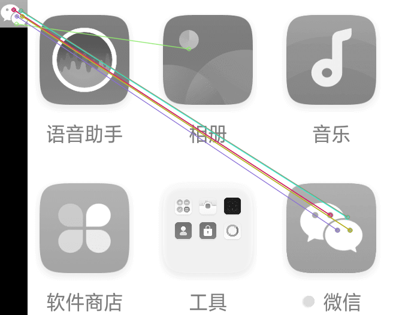

<h1 align="center">findit</h1>

    <em>Find target icon on your picture, and get its position. Painlessly, privately, standardly.</em>

---

---

以**简单**的方式，为**不同平台**、**不同语言**提供可靠的图像识别（目标检测）服务。

它可以被用于：

- app资源遍历
- 页面状态检测
- 全端自动化
- ...

 从我们的 [官方文档](https://williamfzc.github.io/findit/) 开始吧！

# LICENSE

[MIT](LICENSE)
